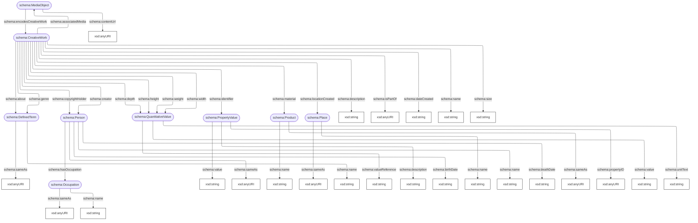

# Kunstcollecties ETL


## Inhoud van deze repository
Deze ETL bestaat uit de volgende onderdelen:
- de workflows in ``` .github/workflows/ ```
- tests in ``` tests/ ```
- configuratie in ``` config/ ```
- code in ``` src/ ``` die bestaat uit:
    - een mapping in ``` src/adlibxml_to_schemaorg_mapping.py ```
    - een lijst van AdlibXML xpaths in ``` src/adlib_xpaths_py ```
    - een lijst AdlibXML elementen in ``` src/adlib_tags.py ```
    - transformatie logica in ``` src/adlib_transformer.py ```
    - harvestering logica in ``` src/harvest_service.py ``` en ``` src/adlib_harvester.py ```

## Context
- Dataset op de Linked Data Voorziening [rijkscollectie-rce](https://linkeddata.cultureelerfgoed.nl/rce/rijkscollectie-rce)
- Mapping op basis van CN model, wat een minder stricte versie van het NDE schema.org applicatieprofiel is.  
- Rechten voor afbeeldingen op Memorix basis van AdlibXML
- Limieten Github Actions en Triply API.

## Running tests
``` python -m pytest -s tests/test_adlib_transformer.py ```

## Running pipeline
``` python src/harvest_service.py --chunks '6000' ```

## Current implementation model
